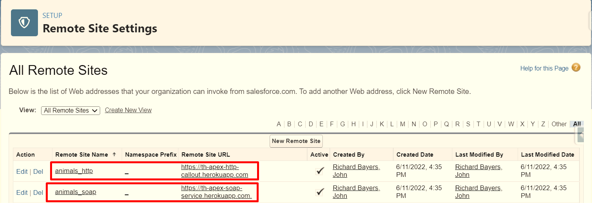

# Trailhead Challenges
> Personal org for my Trailhead Challenges, both admin path and dev path, I will do Hands-on Challenge and questions to further guide for me.

<h2>  Completed </h2> 

| Trail      | Description | Difficulty     |
| :---        |    :----:   |          ---: |
| 💾 [Apex Basics & Database](#Apex)     | Trail to study about basics concepts of the language, SOQL and SOSL      | 1 Quiz and 4 Hands On Challenge   |
| ▶️ [Quick Start - Apex](#ApexQuickStart)     | Trail to write my a simple class update of Accounts      | A guided trail to Create a Class   |
| ▶️ [Quick Start - LWC](#LWCQuickStart)     | Trail to create a simple hello World Component      | A guided trail to Create a LWC   |

 

<h2>  In Progress </h2>

| Trail      | Description | Questions and Challenges     |
| :---        |    :----:   |          ---: |
| 🚧[Apex Test](#ApexTest)   | Trail about Test class in Salesforce     | 3 Hands-on Challenge      |
| 💾 [Apex Basics & Database](#ApexTest)   | Need to make the class challenges again     | 4 Hands-on Challenge      |
| 💾 [Apex Integration](#ApexIntegration)   | Apex Integrations with REST and SOAP     | 2 Hands-on Challenge      |

    

<h2 align="center">   Next Trails  </h2>

| Trail      | Description | Questions and Challenges     |
| :---        |    :----:   |          ---: |
| 🧍[Apex Coding for Admins](https://trailhead.salesforce.com/en/content/learn/projects/quick-start-apex-coding-for-admins)     | Study about SOQL, FOR Loop and Developer Console       | 7 topics about   |

 
 

<h2> Apex Basics & Database </h2> 

**|**  [Trailhead Module](https://trailhead.salesforce.com/content/learn/modules/apex_database)  **|**

 

- [x] 1. **Create an Apex class with a method that returns a list of strings**

*Create an Apex class with a method that returns a list of formatted strings. The length of the list is determined by an integer parameter. You can also use an array if you prefer, but these instructions assume you’re using a list.*

👣Steps👣

>   The Apex class must be called StringArrayTest and be in the public scope
-       The Apex class must have a public static method called generateStringArray
-       The generateStringArray method must return a list of strings
-       The method must accept an incoming Integer as a parameter, which will be used to determine the number of returned strings
-       The method must return a list of strings. Each element in the list must have the format Test n, where n is the index of the current string in the list.
-       For example, if the input is 3, then the output should be ['Test 0', 'Test 1', 'Test 2']. Remember that in Apex, the index position of the first element in a list is always 0.

- ⭐ [Class of the Challenge](./force-app/main/default/classes/Apex-BasicsAndDatabase/StringArrayTest.cls) ⭐
- ✔️ [Guided Class of the Trail](./force-app/main/default/classes/Apex-BasicsAndDatabase/EmailManager.cls) ✔️

- [x] 2. **Use sObjects**

*Explaining about sObjects in Salesforce, showing some instances and explaining about generic SOjbects to specific Sobjects*

❔ Questions ❔

- 1. Describe the relationship between sObjects and Salesforce records.
    A: **(C)** - Every record in Salesforce is natively represented as an sObject in Apex

- 2. You can obtain an instance of an sObject, such as Account, in one of the following ways:
    A: **(B)** - Either by creating the sObject or by retrieving a persistent record from Salesforce using SOQL.

- 3. Which of the following is correct about a generic sObject variable?
    A: **(A)** - Generic sObject variable can be assigned to any specific sObject, standard or custom. Such as Accont or Book__c

 

- [x] 3. **Create a method for inserting accounts.**

*To pass this challenge, create an Apex class that inserts a new account named after an incoming parameter. If the account is successfully inserted, the method should return the account record. If a DML exception occurs, the method should return null.*

👣Steps👣

>   The Apex class must be called AccountHandler and be in the public scope
-       The Apex class must have a public static method called insertNewAccount
-       The method must accept an incoming string as a parameter, which will be used to create the Account name
-       The method must insert the account into the system and then return the record
-       The method must also accept an empty string, catch the failed DML and then return null.

 

❌**I completed the challenge, but in another Org, I will remake this challenge later**❌

 

- [x] 4 - **Create an Apex class that returns contacts based on incoming parameters.**

*Create a class that has a method accepting two strings. The method searches for contacts that have a last name matching the first string and a mailing postal code matching the second. It gets the ID and Name of those contacts and returns them.*

👣Steps👣

>   The Apex class must be called ContactSearch and be in the public scope
-       The Apex class must have a public static method called searchForContacts
-       The method must accept two incoming strings as parameters
-       The method should then find any contact that has a last name matching the first string, and mailing postal code (API name: MailingPostalCode) matching the second string
-       The method should finally return a list of Contact records of type List that includes the ID and Name fields

 

❌**I completed the challenge, but in another Org, I will remake this challenge later**❌
 

- [x] 5 - **Create an Apex class that returns both contacts and leads based on a parameter.**

*To pass this challenge, create an Apex class that returns both contacts and leads that have first or last name matching the incoming parameter.*

👣Steps👣

>   The Apex class must be called ContactAndLeadSearch and be in the public scope
-       The Apex class must have a public static method called searchContactsAndLeads
-       The method must accept an incoming string as a parameter
-       The method should then find any contact or lead that matches the string as part of either the first or last name
-       The method should finally use a return type of List<List< sObject>>
-       NOTE: Because SOSL indexes data for searching, you must create a Contact record and Lead record before checking this challenge. Both records must have the last name Smith. The challenge uses these records for the SOSL search

 

❌**I completed the challenge, but in another Org, I will remake this challenge later**❌

---

<h3> Quick Start: Apex </h3>  

**|**  [Trailhead Module](https://trailhead.salesforce.com/en/content/learn/projects/quickstart-apex)  **|**

 

- [x] 1. **Create an Apex Class**

*Explaining about an Class in Apex and his similarity with Java and C#*

- [x] 2. **Add a Method to the Class**

*Created a method in the Class Older Account utility named updateOlderAccounts that gets the first five Account records ordered by the created date, and update with a description "Heritage Account"*

- [x] 3. **Invoke and Test the Code**

*Explaining about to Execute the method in the Open Execute Anonymous Window*

- [x] 4. **Verify the Updated Accounts**

*After the code executed in the Developer Console, we will see the result in Salesforce*

- ✔️[Class of the Guided Trail](./force-app/main/default/classes/Apex-QuickStart/OlderAccountsUtility.cls) ✔️

---

<h3> Apex Test </h3>  

**|**  [Trailhead Module](https://trailhead.salesforce.com/en/content/learn/modules/apex_testing)  **|**

 

- [x] 1. **Create a Unit Test for a Simple Apex Class**

*Create and install a simple Apex class to test if a date is within a proper range, and if not, returns a date that occurs at the end of the month within the range. You'll copy the code for the class from GitHub. Then write unit tests that achieve 100% code coverage.*

👣Steps👣

> Create an Apex class:
-       Name: VerifyDate
-       Code: Copy from GitHub
-       Place the unit tests in a separate test class:
-       Name: TestVerifyDate
-       Goal: 100% code coverage
-       Run your test class at least once

- ⭐ [Class of the Challenge](./force-app/main/default/classes/Apex-Test/VerifyDate.cls) ⭐
- 🚧 [Test Class of the Challenge](./force-app/main/default/classes/Apex-Test/TestVerifyDate.cls) 🚧

---

- [x] 2. **Create a Unit Test for a Simple Apex Trigger**

*Create and install a simple Apex trigger which blocks inserts and updates to any contact with a last name of 'INVALIDNAME'. You'll copy the code for the class from GitHub. Then write unit tests that achieve 100% code coverage.*

👣Steps👣

>Create an Apex trigger on the Contact object
*       Name: RestrictContactByName
-       Copy from GitHub
-       Place the unit tests in a separate test class
-       Name: TestRestrictContactByName
-       Goal: 100% test coverage
-       Run your test class at least once

- ⭐ [Trigger of the Challenge](./force-app/main/default/triggers/RestrictContactByName.trigger) ⭐
- 🚧 [Test Class of the Challenge](./force-app/main/default/classes/Apex-Test/TestVerifyDate.cls) 🚧

---

<h3> Quick Start: Lightning Web Component </h3>  

**|**  [Trailhead Module](https://trailhead.salesforce.com/content/learn/projects/quick-start-lightning-web-components)  **|**

 

- [x] 1. Create a Hello World Lightning Web Component

*Creating my first Lightning Web Component, the difference between him and Aura Components its to declare how the component is gonna be visible*
**Aura**: *Inside the tag aura:component in cmp file*
**LWC**: *In the meta.xml*

- ✔️ [Guided Component of the Trail](./force-app/main/default/lwc/helloWorld/) ✔️
---

<h3> Apex Integration Services </h3>  

**|**  [Trailhead Module](https://trailhead.salesforce.com/content/learn/modules/apex_integration_services)  **|**

 

- [x] 1. Add two Remote Sites to the Remote Site Settings to allow callouts to external sites.

👣Steps👣

>Create an Apex trigger on the Contact object
*   *Add a Remote Site*
    - **Name:** animals_http
    - **Remote site URL:** th-apex-http-callout.herokuapp.com
    - **Description:** Trailhead animal service: HTTP

*   *Add a Remote Site*
    - **Name:** animals_soap
    - **Remote site URL:** th-apex-soap-service.herokuapp.com
    - **Description:** Trailhead animal service: SOAP

- ✔️**Remote Site Settings Screenshot** ✔️ 

- [x] 2. Create an Apex class that calls a REST endpoint and write a test class.
    *Create an Apex class that calls a REST endpoint to return the name of an animal, write unit tests that achieve 100% code coverage for the class using a mock response, and run your Apex tests.*

👣Steps👣

>Create an Apex class:
*   Name: AnimalLocator
*   Method name: getAnimalNameById
    - The method must accept an Integer and return a String.
    - The method must call https://th-apex-http-callout.herokuapp.com/animals/<id>, replacing <id> with the ID passed into the method 
    - The method returns the value of the name property (i.e., the animal name)

>Create a test class:
*   Name: AnimalLocatorTest
    - The test class uses a mock class called AnimalLocatorMock to mock the callout response

>Create unit tests:
*   Unit tests must cover all lines of code included in the AnimalLocator class, resulting in 100% code coverage
    - Run your test class at least once (via Run All tests the Developer Console) before attempting to verify this challenge

- ⭐ [Class of the Trailhead](./force-app/main/default/classes/Apex-Integration/AnimalsCallouts.cls) ⭐
- 🚧 [Test Class of the Trailhead](./force-app/main/default/classes/Apex-Integration/AnimalsCalloutsTest.cls) 🚧

- ⭐ [Class of the Hands-On Challenge](./force-app/main/default/classes/Apex-Integration/AnimalLocator.cls) ⭐
- 🚧 [Test Class of the Hands-On Challenge](./force-app/main/default/classes/Apex-Test/AnimalLocatorTest.cls) 🚧
- 🚧 [Mock Class of the Hands-On Challenge](./force-app/main/default/classes/Apex-Test/AnimalLocatorMock.cls) 🚧

- [x] 3. Generate an Apex class using WSDL2Apex and write a test class.
    *Generate an Apex class using WSDL2Apex for a SOAP web service, write unit tests that achieve 100% code coverage for the class using a mock response, and run your Apex tests.*

👣Steps👣

>Create an Apex class:
*   Name: AnimalLocator
*   Method name: getAnimalNameById
    - The method must accept an Integer and return a String.
    - The method must call https://th-apex-http-callout.herokuapp.com/animals/<id>, replacing <id> with the ID passed into the method 
    - The method returns the value of the name property (i.e., the animal name)

>Create a test class:
*   Name: AnimalLocatorTest
    - The test class uses a mock class called AnimalLocatorMock to mock the callout response

>Create unit tests:
*   Unit tests must cover all lines of code included in the AnimalLocator class, resulting in 100% code coverage
    - Run your test class at least once (via Run All tests the Developer Console) before attempting to verify this challenge
>Generate a class using this using this WSDL file:
*   Name: ParkService (Tip: After you click the Parse WSDL button, change the Apex class name from parksServices to ParkService)
    - Class must be in public scope
*   Create a class:
    - Name: ParkLocator
    - Class must have a country method that uses the ParkService class
    - Method must return an array of available park names for a particular country passed to the web service (such as Germany, India, Japan, and United States)
*   Create a test class:
    - Name: ParkLocatorTest
    - Test class uses a mock class called ParkServiceMock to mock the callout response
*   Create unit tests:
    - Unit tests must cover all lines of code included in the ParkLocator class, resulting in 100% code coverage.
    - Run your test class at least once (via Run All tests the Developer Console) before attempting to verify this challenge.

- ⭐ [SOAP Calculator Services class of the Trailhead](./force-app/main/default/classes/Apex-Integration/calculatorServices.cls) ⭐
- ⭐ [SOAP Async Calculator Services class of the Trailhead](./force-app/main/default/classes/Apex-Integration/AsyncCalculatorServices.cls) ⭐
- ⭐ [Class of the Trailhead](./force-app/main/default/classes/Apex-Integration/AwesomeCalculator.cls) ⭐
- 🚧 [Test Class of the Trailhead](./force-app/main/default/classes/Apex-Integration/AwesomeCalculatorTest.cls) 🚧
- 🚧 [Mock Class of the Trailhead](./force-app/main/default/classes/Apex-Integration/CalculatorCalloutMock.cls) 🚧

- ⭐ [Class of the Hands-On Challenge](./force-app/main/default/classes/Apex-Integration/AnimalLocator.cls) ⭐
- 🚧 [Test Class of the Hands-On Challenge](./force-app/main/default/classes/Apex-Test/AnimalLocatorTest.cls) 🚧
- 🚧 [Mock Class of the Hands-On Challenge](./force-app/main/default/classes/Apex-Test/AnimalLocatorMock.cls) 🚧

